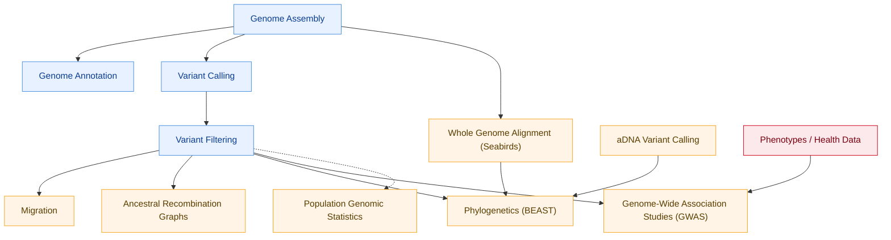

# Propose Directory Structure

## 'Foundational' Data Analysis (used in every analysis below)
00_Genome_Assembly/
01_Genome_Annotation/
02_Variant_Calling/
03_Variant_Filtering/

## Things that aren't used by every analysis / are their own analyses
ANALYSIS_aDNA_Variant_Calling/
ANALYSIS_Ancestral_Recombination_Graphs/
ANALYSIS_Genome_Wide_Association_Studies/
ANALYSIS_Migration/
ANALYSIS_Phylogenetics_BEAST/
ANALYSIS_Population_Genomic_Statistics/
ANALYSIS_Whole_Genome_Alignment_Seabirds/

[See Kakapo Repo](https://github.com/genomicsAotearoa/kakapo)
